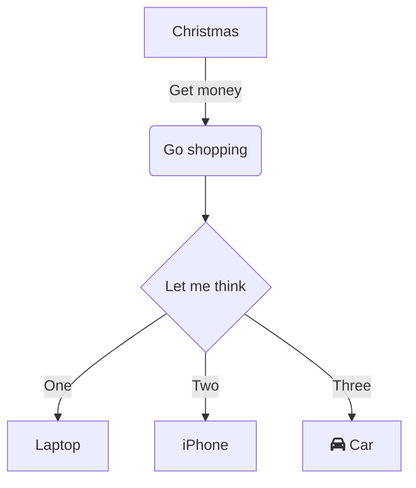

## Welcome to my new blog !

It's exciting to start this new section. Here, I will share my reflections and discoveries on diverse technical subjects.

### Why MDX ?

I chose MDX because it allows me to :

- Write in Markdown, which is simple and fast.
- Integrate interactive components (Astro, React, Svelte, Vue...) directly into my articles.
- Have a great flexibility for style and animations.

### An example of component

Here is a simple counter to illustrate the integration of components.
(We will have to create this component `SimpleCounter.astro` or `.tsx` later)

{/* <SimpleCounter client:load /> */}

Stay tuned for more content!
